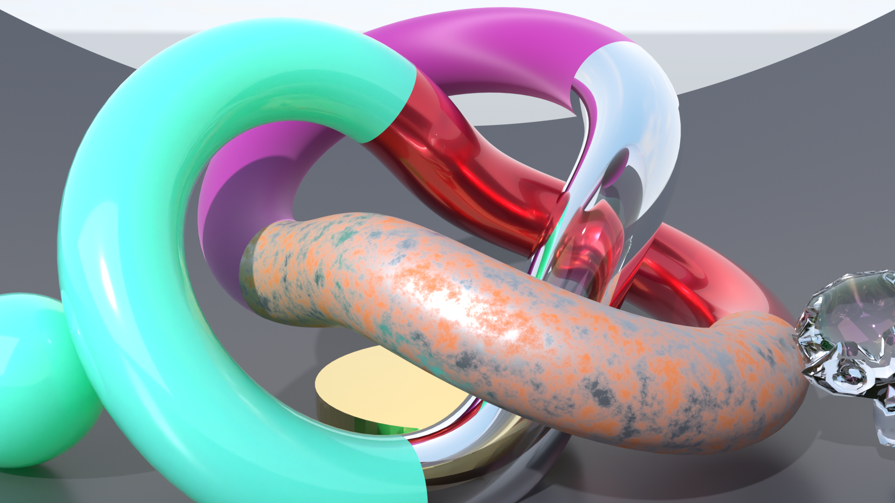
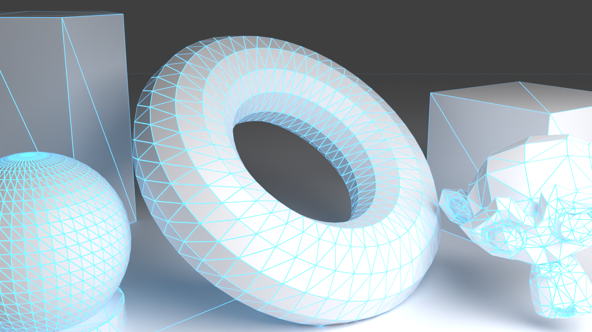
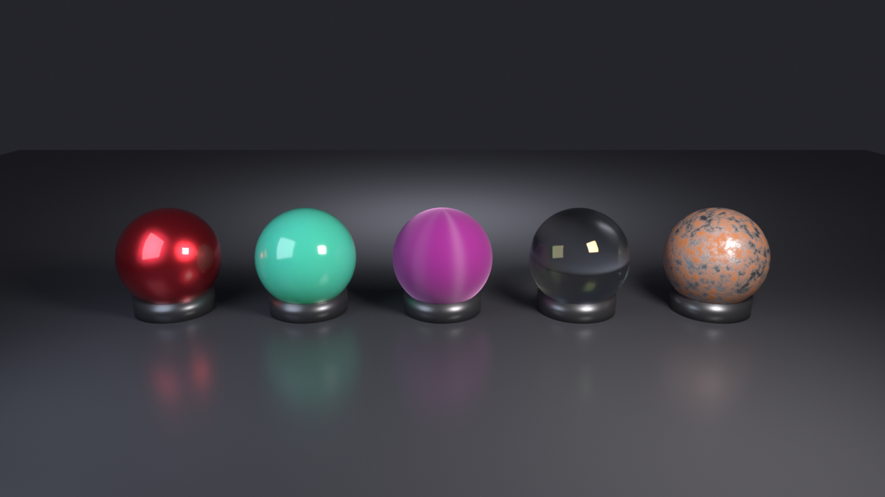
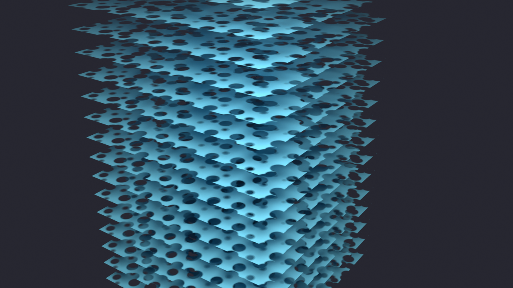

# GPUBench

GPUBench is a high-performance cross-platform GPU benchmarking tool designed to measure raw compute capabilities, memory bandwidth, and modern hardware ray tracing pipeline architectures across graphics hardware. It supports multiple backends and a wide range of data types, from double-precision floating point (FP64) down to 4-bit integers (INT4), alongside cutting-edge ray scheduling architectures.


## Features

- **Multi-Backend Support**: Benchmarks using Vulkan, OpenCL, and ROCm/HIP.
- **Hardware Ray Tracing Suite**:
  - **Ray Scheduling Architectures**: Megakernel vs. Hardware Shader Execution Reordering (SER) vs. Work Lists / Device-Generated Commands (DGC) vs. Autonomous Work Graphs (`VK_AMDX_shader_enqueue`).
  - **Real-World Material Divergence**: Realistic heterogeneous material distributions testing VGPR allocation pressure and SIMD wave divergence.
  - **Spatial Ray Divergence**: Parametric cone divergence measuring BVH traversal cache hit rates.
  - **Multi-Layer Alpha Testing**: AnyHit alpha evaluation through 16 stacked cutout planes.
  - **Acceleration Structure Throughput**: BLAS/TLAS build and dynamic vertex refit rates.
- **Comprehensive Compute Data Types**: 
  - Floating Point: FP64, FP32, FP16, FP8, FP6, FP4
  - Integer: INT8, INT4
- **Memory & Cache Hierarchy**: Measure Device VRAM Bandwidth, Host/PCIe Bandwidth, and L1/L2/L3 Cache latency and throughput.
- **Dynamic Loading**: Backends are loaded at runtime, making them optional and reducing installation dependencies.
- **Cross-Platform**: Built for Linux and Windows.

## Supported Backends

| Backend | Platform | Primary Use Case | Minimum Version |
| :--- | :--- | :--- | :--- |
| **Vulkan** | Linux, Windows | Standard cross-vendor compute & ray tracing | 1.4+ |
| **OpenCL** | Linux, Windows | Fallback cross-vendor compute | 1.2+ |
| **ROCm/HIP** | Linux | Native AMD performance | 6.4+ |

---

## Hardware Ray Tracing & Scheduling Architectures

Modern ray tracing performance in production games and visual effects engines is rarely bound by simple triangle intersection; it is bound by **divergence**—both spatial ray direction divergence and material shading divergence.

GPUBench evaluates how different GPU hardware architectures handle these workloads across four distinct scheduling architectures:

1. **Traditional Megakernel**: Traces rays and evaluates all hit shading in a single massive compute pass. Suffering from the "convoy effect," a single complex material forces all lanes to allocate worst-case VGPRs and serializes execution over divergent SIMD branches.
2. **Traditional + SER (Shader Execution Reordering)**: Leverages hardware reordering (`VK_KHR_ray_tracing_reorder` / NV SER) to dynamically regroup divergent lanes by spatial direction and material hit ID before executing hit shaders.
3. **Work Lists / DGC (Wavefront Compaction)**: Compacts divergent hits into categorized material queues via atomic work lists and dispatches uniform waves using indirect command generation (`vkCmdDispatchIndirect`).
4. **Work Graphs (Autonomous Node Enqueue)**: Uses GPU-autonomous execution graph pipelines (`VK_AMDX_shader_enqueue`) to dynamically enqueue child nodes without host or CPU round-trips.

#### Dual-Scenario Benchmarking Morphology
- **Complex Indoor Atrium (`-s indoor`)**: $35,272$ triangles with 0% sky escape, 8 heterogeneous production BSDFs, and 4-bounce path tracing. Work Lists achieve a **4.80x speedup** in material shading and **2.00x speedup** in path tracing.
- **Open-World Outdoor Landscape (`-s outdoor`)**: $57,216$ triangles spanning $>2000\text{m}$ terrain, river, conifer foliage, and atmospheric Rayleigh-Mie scattering. Work Lists achieve a **1.87x speedup** in incoherent secondary rays and run primary RT at **3,184 FPS** (6,603 MRays/s).
- **100% Bit-Exact Parity**: Verified bit-exact 120.00 dB PSNR and 0 discrepant pixels between paradigms.

---

### Realistic Material Divergence

Real-world production scenes never contain uniform, toy shaders—they feature a **heterogeneous range of materials** with radically different computational weights and register footprints.


*Fig 1: Representative still-life showroom scene featuring a heterogeneous distribution of production material archetypes.*


*Fig 2: Wireframe view showing the underlying geometry, mesh density, and topological curvature of the test scene.*

#### Reference Material Archetypes


*Fig 3: Lineup of production material candidates on test pedestals.*

| Archetype | Reference Shading Model | Computational / SIMD Bottleneck |
| :--- | :--- | :--- |
| **Clearcoat Car Paint** | Dual-specular GGX lobes (clearcoat + metallic substrate), Beer-Lambert absorption, high-frequency Voronoi micro-flake glints. | Multi-lobe evaluation, procedural hash functions, secondary normal perturbations. |
| **Dispersive Crystal / Glass** | Snell's law refraction with total internal reflection (TIR) branching, Cauchy spectral dispersion, 450 nm thin-film wave interference. | Hard directional ray branching (reflection vs. transmission), trigonometric Airy interference series. |
| **Organic Jade / Wax** | Multi-channel subsurface diffusion profile ($R, G, B$ differing mean free paths), dual-lobe surface gloss. | Multi-channel exponential attenuation, non-local volumetric scattering. |
| **Anisotropic Velvet / Fabric** | Dual-axis anisotropic roughness ($a_x \neq a_y$) with tangent frame rotation, Charlie micro-fiber inverted grazing sheen ($D_{\text{charlie}}$). | Tangent-space matrix transforms, transcendental power functions ($x^{1/2\alpha}$). |
| **Weathered Industrial Rust** | 6-octave Fractal Brownian Motion (FBM) noise loops, continuous dynamic phase transition from conductor steel to porous dielectric rust. | Heavy arithmetic loop execution, divergent multi-octave iteration depth. |
| **Matte Ceramic & Concrete** | Standard Lambertian/Oren-Nayar diffuse PBR. | Minimal ALU baseline, high wave occupancy. |

#### Analytic Atmospheric Skybox Model

When secondary rays escape geometric boundaries into the surrounding environment, GPUBench evaluates an algebraic Rayleigh-Mie atmospheric scattering model with Henyey-Greenstein solar aureole forward scattering:


*Fig 4: 360° equirectangular preview of the mathematical atmospheric sky model evaluated when rays miss geometry.*

Stressing arithmetic ALUs on miss without querying large VRAM texture maps ensures that BVH traversal and material divergence remain the dominant bottlenecks without cache pollution from texture filtering units.

---

### Geometry & BVH Traversal Benchmarks


*Fig 5: 16 stacked alpha-tested cutout planes used in the `RayAnyHit` benchmark to measure BVH AnyHit invocation overhead.*

* **Multi-Layer Alpha Testing (`RayAnyHit`)**: Measures hardware performance when traversing through transparent foliage and cutout surfaces. Tests BVH traversal with stochastic opacity cutouts across 16 stacked geometric planes.
* **Spatial Cone Ray Divergence (`RayDivergence`)**: Sweeps ray cone distribution angles from $\theta = 0^\circ$ (fully coherent primary rays) to $\theta = 90^\circ$ (fully diffuse hemispherical rays) to benchmark L1/L2 cache hit rates in GPU BVH traversal units.

---

## Quick Start

### Prerequisites

Ensure you have the appropriate drivers and SDKs installed for the backends you wish to use. See [VERSION_REQUIREMENTS.md](VERSION_REQUIREMENTS.md) for details.

### Installation

Download the latest release package (`.rpm`, `.deb`, `.tar.gz`) from the [GitHub Releases](https://github.com/Soddentrough/GPUBench/releases) page or build from source following the [INSTALL.md](INSTALL.md) guide.

### Basic Usage

```bash
# List all available benchmarks
gpubench --list-benchmarks

# Run all benchmarks on default device
gpubench

# Run Ray Scheduling on a specific GPU device (e.g. Device 1)
gpubench -d 1 -b RayScheduling

# Select benchmark scene morphology: indoor (default), outdoor, or all
gpubench -d 1 -b RayScheduling -s outdoor
gpubench -d 1 -b RayScheduling -s all

# Dump 1080p PPM/PNG render buffers and analytical diff heatmaps to renders/
gpubench -d 1 -b RayScheduling -s indoor --dump-frames

# Run isolated sub-workload config (0-15) in single-submit profiling mode
gpubench -d 1 -b RayScheduling -s indoor -c 2 --profile-snapshot

# Export results to JSON
gpubench -d 1 --json benchmark_results.json
```

### Profiling & Telemetry Suite

GPUBench includes turnkey Python tools for automated thread tracing with Mesa RADV / Radeon GPU Profiler (RGP) and AMD ROCm SMI telemetry:

```bash
# Capture RGP traces, amd-smi power/clock telemetry, and RGA ISA compilation
python3 scripts/capture_gpu_profiles.py
```

## Documentation

- [Installation Guide](INSTALL.md) - Detailed build and install instructions.
- [Ray Scheduling Architectures](docs/RAY_SCHEDULING_ARCHITECTURE.md) - Deep dive into decoupled scheduling, microarchitectural ISA analysis, and RGP timeline profiling.
- [Performance Analysis](PERFORMANCE_ANALYSIS.md) - Compute and memory subsystem benchmarking.
- [Version Requirements](VERSION_REQUIREMENTS.md) - Software and hardware requirements.
- [OpenCL Backend](OPENCL_BACKEND.md) - Details on the OpenCL implementation.
- [Windows Packaging](WINDOWS_PACKAGING.md) - Instructions for Windows users.

## License

This project is licensed under the MIT License - see the [LICENSE](LICENSE) file for details.
