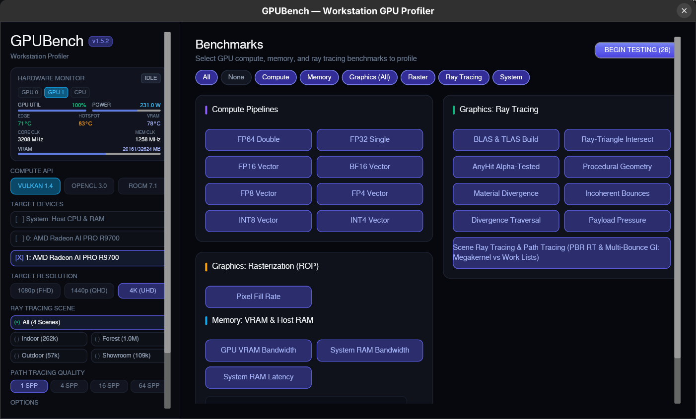

# GPUBench

GPUBench is a high-performance cross-platform GPU benchmarking tool designed to measure raw compute capabilities, memory bandwidth, and modern hardware ray tracing pipeline architectures across graphics hardware. It supports multiple backends and a wide range of data types, from double-precision floating point (FP64) down to 4-bit integers (INT4), alongside modern hardware ray scheduling architectures.


## Features

- **Multi-Backend Support**: Benchmarks using Vulkan, OpenCL, and ROCm/HIP.
- **Hardware Ray Tracing Suite**:
  - **Ray Scheduling Architectures**: Megakernel vs. Hardware Shader Execution Reordering (SER) vs. Device-Generated Commands (DGC).
  - **Real-World Material Divergence**: Realistic heterogeneous material distributions testing VGPR allocation pressure and SIMD wave divergence.
  - **Spatial Ray Divergence**: Parametric cone divergence measuring BVH traversal cache hit rates.
  - **Multi-Layer Alpha Testing**: AnyHit alpha evaluation through 16 stacked cutout planes.
  - **Acceleration Structure Throughput**: BLAS/TLAS build and dynamic vertex refit rates.
- **Comprehensive Compute Data Types**: 
  - Floating Point: FP64, FP32, FP16, FP8, FP6, FP4
  - Integer: INT8, INT4
- **Memory & Cache Hierarchy**: Measure Device VRAM Bandwidth, Host/PCIe Bandwidth, and L1/L2/L3 Cache latency and throughput.
- **Dynamic Loading**: Backends are loaded at runtime, making them optional and reducing installation dependencies.
- **Cross-Platform**: Built for Linux and Windows.

## Supported Backends

| Backend | Platform | Primary Use Case | Minimum Version |
| :--- | :--- | :--- | :--- |
| **Vulkan** | Linux, Windows | Standard cross-vendor compute & ray tracing | 1.4+ |
| **OpenCL** | Linux, Windows | Fallback cross-vendor compute | 1.2+ |
| **ROCm/HIP** | Linux | Native AMD performance | 6.4+ |

---

## Interfaces & Default Output

GPUBench provides both a standalone graphical workstation profiler with live hardware telemetry and a rich command-line interface with hierarchical Unicode reporting.

### Graphical User Interface (GUI)

The Workstation Profiler dashboard (`gpubench-gui`) provides real-time GPU telemetry (utilization, package power, core and memory clocks, temperatures, and VRAM usage), dynamic physical hardware device detection, compute API diagnostics with requirement tooltips, responsive multi-scale DPI layout (1.0x–2.5x), benchmark suite configuration with dedicated score columns, and in-application comparative ray tracing inspection:


*Fig: GPUBench Workstation Profiler GUI showing real-time hardware telemetry HUD, backend selection, and benchmark suite configuration.*

### Command-Line Interface (CLI)

Running `gpubench` in the terminal runs the preparation phase, compiles compute and ray tracing pipelines with an interactive ticker, and prints a hierarchical card report with throughput, memory latencies, and architectural speedup takeaways:

```text
$ gpubench -d 1

╭─ GPUBench v1.0.0 ────────────────────────────────────────────────────────╮
│ Target Device : [GPU 1] AMD Radeon AI PRO R9700 (RADV GFX1201)           │
│ Backend / API : Vulkan | VRAM: 32 GB GDDR                                │
╰──────────────────────────────────────────────────────────────────────────╯

  [1/2] Preparation Phase (compiling kernels, uploading data, building BVHs)...
  Progress: [━━━━━━━━━━━━━━━━━━━━━━━━━━━━] 100% Compiling pipelines
  ✔ Preparation complete.

  [2/2] Running Benchmarks...
  ✔ Benchmark suite completed.


  ╭─ GPUBench Hierarchical Benchmark Report ─────────────────────────────────────────────────────────────────────────────────────╮
  │ Target Device : AMD Radeon AI PRO R9700 (RADV GFX1201) (ID: 1)                                                               │
  ╰──────────────────────────────────────────────────────────────────────────────────────────────────────────────────────────────╯

  [Compute]
  ╭─ FP64 ───────────────────────────────────────────────────────────────────────────────────────────────────────────────────────╮
  │ Workload                                     │ Backend  │             Throughput │ Details / Speedup                         │
  ├──────────────────────────────────────────────┼──────────┼────────────────────────┼───────────────────────────────────────────┤
  │ FP64                                         │ Vulkan   │            0.85 TFLOPS │                                           │
  ╰──────────────────────────────────────────────┴──────────┴────────────────────────┴───────────────────────────────────────────╯
  ╭─ FP32 ───────────────────────────────────────────────────────────────────────────────────────────────────────────────────────╮
  │ Workload                                     │ Backend  │             Throughput │ Details / Speedup                         │
  ├──────────────────────────────────────────────┼──────────┼────────────────────────┼───────────────────────────────────────────┤
  │ FP32                                         │ Vulkan   │           47.73 TFLOPS │                                           │
  ╰──────────────────────────────────────────────┴──────────┴────────────────────────┴───────────────────────────────────────────╯
  ╭─ FP16 ───────────────────────────────────────────────────────────────────────────────────────────────────────────────────────╮
  │ Workload                                     │ Backend  │             Throughput │ Details / Speedup                         │
  ├──────────────────────────────────────────────┼──────────┼────────────────────────┼───────────────────────────────────────────┤
  │ Vector                                       │ Vulkan   │           53.64 TFLOPS │ [Baseline]                                │
  │ Matrix                                       │ Vulkan   │          202.96 TFLOPS │ └──> 3.78x (+278.4%)                      │
  ╰──────────────────────────────────────────────┴──────────┴────────────────────────┴───────────────────────────────────────────╯
  ╭─ INT8 ───────────────────────────────────────────────────────────────────────────────────────────────────────────────────────╮
  │ Workload                                     │ Backend  │             Throughput │ Details / Speedup                         │
  ├──────────────────────────────────────────────┼──────────┼────────────────────────┼───────────────────────────────────────────┤
  │ Vector                                       │ Vulkan   │             40.45 TOPS │ [Baseline]                                │
  │ Matrix                                       │ Vulkan   │            387.76 TOPS │ └──> 9.59x (+858.7%)                      │
  ╰──────────────────────────────────────────────┴──────────┴────────────────────────┴───────────────────────────────────────────╯

  [Memory]
  ╭─ Latency ────────────────────────────────────────────────────────────────────────────────────────────────────────────────────╮
  │ Workload                                     │ Backend  │             Throughput │ Details / Speedup                         │
  ├──────────────────────────────────────────────┼──────────┼────────────────────────┼───────────────────────────────────────────┤
  │ L0 Cache Latency                             │ Vulkan   │               30.94 ns │                                           │
  │ L1 Cache Latency                             │ Vulkan   │               65.15 ns │                                           │
  │ L2 Cache Latency                             │ Vulkan   │               83.61 ns │                                           │
  │ L3 Cache Latency                             │ Vulkan   │              154.81 ns │                                           │
  ╰──────────────────────────────────────────────┴──────────┴────────────────────────┴───────────────────────────────────────────╯
  ╭─ Bandwidth ──────────────────────────────────────────────────────────────────────────────────────────────────────────────────╮
  │ Workload                                     │ Backend  │             Throughput │ Details / Speedup                         │
  ├──────────────────────────────────────────────┼──────────┼────────────────────────┼───────────────────────────────────────────┤
  │ VRAM Read (256 threads/group)                │ Vulkan   │            626.40 GB/s │                                           │
  │ VRAM Write (256 threads/group)               │ Vulkan   │            282.07 GB/s │                                           │
  │ VRAM Combined R/W (256 threads/group)        │ Vulkan   │            564.40 GB/s │                                           │
  ╰──────────────────────────────────────────────┴──────────┴────────────────────────┴───────────────────────────────────────────╯

  [Ray Tracing]
  ╭─ Hardware Traversal & Acceleration ──────────────────────────────────────────────────────────────────────────────────────────╮
  │ Workload                                     │ Backend  │             Throughput │ Details / Speedup                         │
  ├──────────────────────────────────────────────┼──────────┼────────────────────────┼───────────────────────────────────────────┤
  │ Hardware Ray-Triangle Intersection           │ Vulkan   │          1435.56 GIS/s │                                           │
  │ Hardware Ray-Box Traversal                   │ Vulkan   │           672.38 GIS/s │                                           │
  │ Primary rays (coherent)                      │ Vulkan   │       5,600.04 MRays/s │                                           │
  │ Secondary bounce rays (incoherent)           │ Vulkan   │       3,083.89 MRays/s │                                           │
  │ AnyHit Opacity Alpha-Testing                 │ Vulkan   │          37.28 GRays/s │                                           │
  │ Procedural Geometry (AABB Spheres)           │ Vulkan   │          38.22 GRays/s │                                           │
  │ BLAS Construction (1M Triangles)             │ Vulkan   │          50.74 MTris/s │                                           │
  │ Dynamic BLAS Refit / Update                  │ Vulkan   │         117.91 MTris/s │                                           │
  │ TLAS Instance Hierarchy (10K Instances)      │ Vulkan   │           1.71 MInst/s │                                           │
  ╰──────────────────────────────────────────────┴──────────┴────────────────────────┴───────────────────────────────────────────╯
  ╭─ Ray Scheduling Architectures (PBR Sponza) ──────────────────────────────────────────────────────────────────────────────────╮
  │ Workload                                     │ Backend  │             Throughput │ Details / Speedup                         │
  ├──────────────────────────────────────────────┼──────────┼────────────────────────┼───────────────────────────────────────────┤
  │ Megakernel                                   │ Vulkan   │         207.34 MRays/s │ [Baseline] [25.0 FPS]                     │
  │ DGC                                          │ Vulkan   │         558.19 MRays/s │ └──> 2.69x (+169.2%) [67.3 FPS]           │
  ╰──────────────────────────────────────────────┴──────────┴────────────────────────┴───────────────────────────────────────────╯

  ╭─ Executive Performance Summary & Architectural Takeaways ────────────────────────────────────────────────────────────────────╮
  │ • Wavefront Scheduling Speedup : 2.69x in PBR Ray Tracing (558.2 vs 207.3 MRays/s)                                           │
  │ • Acceleration Build Peak Rates : 117.9 MTris/s (BLAS Update) | 1.7 MInst/s (TLAS Construction)                              │
  │ • Hardware BVH8 Box Peak Rate   : 672.4 GIS/s (55.9% of 1.20 TIS/s Boost Peak)                                               │
  │ • Hardware Triangle Peak Rate   : 1435.6 GIS/s (477.2% of 300.8 GIS/s Boost Peak)                                            │
  │ • Peak Measured Ray Rate        : 5,600.0 MRays/s (Primary rays (coherent))                                                  │
  ╰──────────────────────────────────────────────────────────────────────────────────────────────────────────────────────────────╯
```

---

## Hardware Ray Tracing & Scheduling Architectures

Modern ray tracing performance in production games and visual effects engines is rarely bound by simple triangle intersection; it is bound by **divergence**—both spatial ray direction divergence and material shading divergence.

GPUBench evaluates how different GPU hardware architectures handle these workloads across distinct scheduling architectures:

1. **Traditional Megakernel**: Traces rays and evaluates all hit shading in a single compute pass. Suffering from the "convoy effect," a single complex material forces all lanes to allocate worst-case VGPRs and serializes execution over divergent SIMD branches.
2. **Traditional + SER (Shader Execution Reordering)**: Leverages hardware reordering (`VK_KHR_ray_tracing_reorder` / `VK_EXT_ray_tracing_invocation_reorder`) to dynamically regroup divergent lanes by spatial direction and material hit ID before executing hit shaders.
3. **Device-Generated Commands (DGC / Wavefront Compaction)**: Compacts divergent hits into categorized material queues via ballot/atomic compaction and dispatches uniform waves using GPU-driven command generation (`VK_EXT_device_generated_commands`).

#### Four-Scenario Benchmarking Morphology
- **Showroom Studio (`-s showroom`)**: $108,936$ triangles featuring the Khronos ToyCar glTF asset with clearcoat, decals, and velvet pedestal. Device-Generated Commands (DGC) achieve **101.3 FPS** vs. Megakernel **57.6 FPS** (**1.76x speedup**).
- **Complex Indoor Atrium (`-s indoor`)**: $262,267$ triangles featuring Crytek Sponza glTF with 25 PBR materials and 0% sky escape. Device-Generated Commands (DGC) achieve **68.0 FPS** vs. Megakernel **30.5 FPS** (**2.23x speedup**).
- **Open-World Outdoor Landscape (`-s outdoor`)**: $57,216$ triangles spanning $>2000\text{m}$ alpine terrain, lake, conifer foliage, and Rayleigh-Mie atmospheric scattering. Device-Generated Commands (DGC) achieve **420.0 FPS** vs. Megakernel **185.8 FPS** (**2.26x speedup**).
- **Open-World Forest (`-s forest`)**: $1,001,280$ triangles featuring high-density 512×512 terrain, river bathymetry, 850 trees, and 8 nature PBR shaders. Device-Generated Commands (DGC) achieve **55.0 FPS** vs. Megakernel **27.0 FPS** (**2.04x speedup**).
- **100% Bit-Exact Analytical Parity**: Verified bit-exact 120.00 dB PSNR, 0.000000 MAE, and 0 discrepant pixels across all 8,294,400 pixels at 4K UHD across all four scenarios.

---

### Realistic Material Divergence

Production scenes rarely contain uniform shaders; they feature a **heterogeneous distribution of materials** with differing computational complexity and register footprints.


*Fig 1: Representative still-life showroom scene featuring a heterogeneous distribution of production material archetypes.*


*Fig 2: Wireframe view showing the underlying geometry, mesh density, and topological curvature of the test scene.*

#### Reference Material Archetypes


*Fig 3: Lineup of production material candidates on test pedestals.*

| Archetype | Reference Shading Model | Computational / SIMD Bottleneck |
| :--- | :--- | :--- |
| **Clearcoat Car Paint** | Dual-specular GGX lobes (clearcoat + metallic substrate), Beer-Lambert absorption, high-frequency Voronoi micro-flake glints. | Multi-lobe evaluation, procedural hash functions, secondary normal perturbations. |
| **Dispersive Crystal / Glass** | Snell's law refraction with total internal reflection (TIR) branching, Cauchy spectral dispersion, 450 nm thin-film wave interference. | Directional ray branching (reflection vs. transmission), trigonometric Airy interference series. |
| **Organic Jade / Wax** | Multi-channel subsurface diffusion profile ($R, G, B$ differing mean free paths), dual-lobe surface gloss. | Multi-channel exponential attenuation, non-local volumetric scattering. |
| **Anisotropic Velvet / Fabric** | Dual-axis anisotropic roughness ($a_x \neq a_y$) with tangent frame rotation, Charlie micro-fiber inverted grazing sheen ($D_{\text{charlie}}$). | Tangent-space matrix transforms, transcendental power functions ($x^{1/2\alpha}$). |
| **Weathered Industrial Rust** | 6-octave Fractal Brownian Motion (FBM) noise loops, continuous dynamic phase transition from conductor steel to porous dielectric rust. | Heavy arithmetic loop execution, divergent multi-octave iteration depth. |
| **Matte Ceramic & Concrete** | Standard Lambertian/Oren-Nayar diffuse PBR. | Minimal ALU baseline, high wave occupancy. |

#### Analytic Atmospheric Skybox Model

When secondary rays escape geometric boundaries into the surrounding environment, GPUBench evaluates an algebraic Rayleigh-Mie atmospheric scattering model with Henyey-Greenstein solar aureole forward scattering:


*Fig 4: 360° equirectangular preview of the mathematical atmospheric sky model evaluated when rays miss geometry.*

Stressing arithmetic ALUs on miss without querying large VRAM texture maps ensures that BVH traversal and material divergence remain the dominant bottlenecks without cache pollution from texture filtering units.

---

### Geometry & BVH Traversal Benchmarks


*Fig 5: 16 stacked alpha-tested cutout planes used in the `RayAnyHit` benchmark to measure BVH AnyHit invocation overhead.*

* **Multi-Layer Alpha Testing (`RayAnyHit`)**: Measures hardware performance when traversing through transparent foliage and cutout surfaces. Tests BVH traversal with stochastic opacity cutouts across 16 stacked geometric planes.
* **Spatial Cone Ray Divergence (`RayDivergence`)**: Sweeps ray cone distribution angles from $\theta = 0^\circ$ (fully coherent primary rays) to $\theta = 90^\circ$ (fully diffuse hemispherical rays) to benchmark L1/L2 cache hit rates in GPU BVH traversal units.

---

## Quick Start

### Prerequisites

Ensure you have the appropriate drivers and SDKs installed for the backends you wish to use. See [VERSION_REQUIREMENTS.md](VERSION_REQUIREMENTS.md) for details.

### Installation

Download the latest release package (`.rpm`, `.deb`, `.tar.gz`) from the [GitHub Releases](https://github.com/Soddentrough/GPUBench/releases) page or build from source following the [INSTALL.md](INSTALL.md) guide.

### Basic Usage

```bash
# List all available benchmarks
gpubench --list-benchmarks

# List compute backend availability and diagnostic status
gpubench --list-backends

# Run all benchmarks on default device
gpubench

# Run Ray Scheduling on a specific GPU device (e.g. Device 1)
gpubench -d 1 -b RayScheduling

# Select benchmark scene morphology: showroom, indoor, outdoor, forest, or all
gpubench -d 1 -b rayscheduling -s forest
gpubench -d 1 -b rayscheduling -s all

# Set render resolution preset (720p, 1080p, 1440p, 4k) or custom WxH (default: auto; 4K UHD on >=16GB VRAM)
gpubench -d 1 -b rayscheduling -s forest -r 4k

# Dump 4K UHD PPM/PNG render buffers, diff heatmaps, and 4-scenario comparative grid
gpubench -d 1 -b rayscheduling -s all --dump-renders

# Run specific config (e.g. Config 21: Primary Rays (Megakernel), Config 22: Primary Rays (DGC)) in profiling snapshot mode
gpubench -d 1 -b rayscheduling -s forest -c 22 --profile-snapshot

# Export machine-readable results to JSON
gpubench -d 1 -b rayscheduling -s all -o benchmark_results.json
```

### Profiling & Telemetry Suite

GPUBench includes Python tools for automated thread tracing with Mesa RADV / Radeon GPU Profiler (RGP) and AMD ROCm SMI telemetry:

```bash
# Capture RGP traces, amd-smi power/clock telemetry, and RGA ISA compilation
python3 scripts/capture_gpu_profiles.py
```

## Documentation

### Core Guides
- [Installation Guide](INSTALL.md) - Cross-platform build and installation instructions.
- [Windows Environment & Build Guide](WINDOWS.md) - MinGW toolchain, packaging, and Windows guidelines.
- [Version Requirements](VERSION_REQUIREMENTS.md) - Minimum software and compute hardware requirements.
- [Release Process](RELEASING.md) - Tagging, CI packaging, and automated release deployment.

### Architectural & Technical Whitepapers
- [Ray Scheduling Architectures](docs/RAY_SCHEDULING_ARCHITECTURE.md) - Decoupled scheduling, microarchitectural ISA analysis, and RGP timeline profiling.
- [BVH Traversal Architectural Audit](docs/BVH_TRAVERSAL_ARCHITECTURAL_AUDIT.md) - Hardware BVH traversal ceilings, box and triangle peak rates on RDNA 4.
- [RDNA 3 Ray Tracing Architecture](docs/RDNA3_RAY_TRACING_ARCHITECTURE.md) - Chiplet topology, memory fabric, and zero-LDS pure Wave32 compaction.
- [Hardware Profiling & Telemetry Guide](docs/PROFILING_GUIDE.md) - RGA disassembly, ACO compiler stats, packet dumping, and SMI telemetry.
- [Compute Performance Analysis](docs/COMPUTE_PERFORMANCE_ANALYSIS.md) - Compute pipelines, packed math, and compiler ceilings.
- [OpenCL Backend](docs/OPENCL_BACKEND.md) - Architecture, feature matrix, and disk binary caching.
- [Desktop Integration](docs/DESKTOP_INTEGRATION.md) - FreeDesktop XDG, Windows High-DPI manifest, and macOS app bundle integration.

## License

This project is licensed under the MIT License - see the [LICENSE](LICENSE) file for details.
